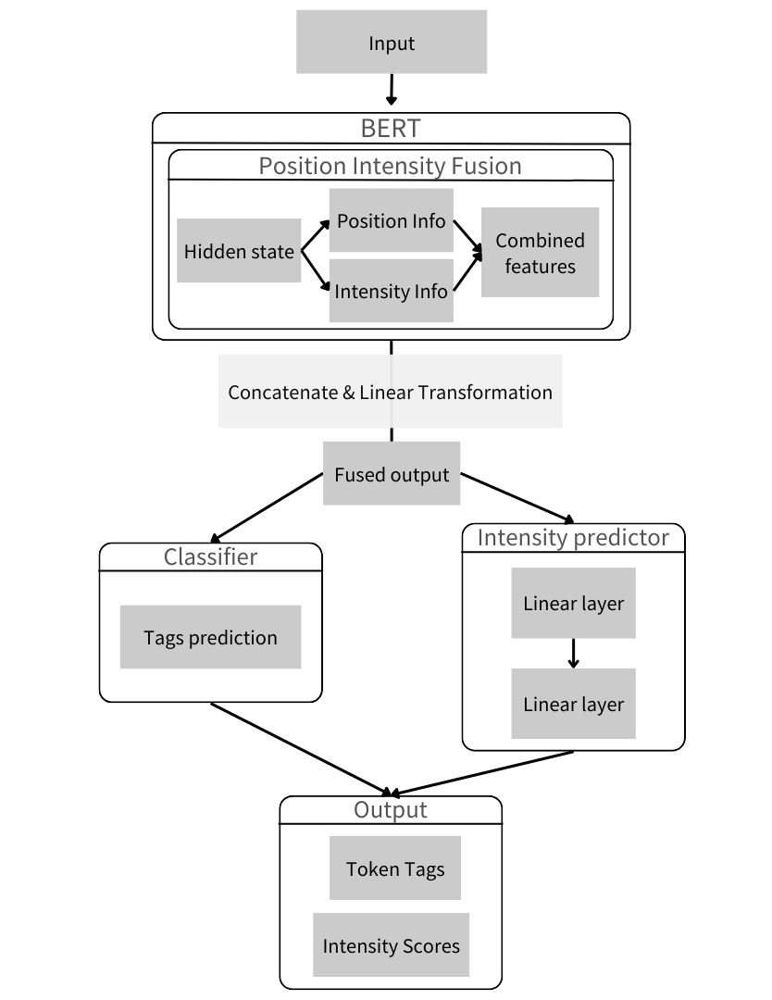

# 🌐 Dimensional Aspect Sentiment Triplet Extraction (ASTE)

This project proposes a **BERT-based model with Position–Intensity Fusion** for **Aspect Sentiment Triplet Extraction (ASTE)**.  
It extracts **aspect terms**, their corresponding **opinion terms**, and the **sentiment intensity scores**, providing a fine-grained understanding of opinions expressed in text.

## 📖 Task Definition
Given a sentence, the model identifies:
1. **Aspect Term (A)** — the entity being evaluated.  
2. **Opinion Term (O)** — the sentiment expression toward the aspect.  
3. **Sentiment Intensity** — fine-grained scores representing sentiment strength.  

**Example**  
Input: E0002:S002, 不僅餐點美味上菜速度也是飛快耶！！
Output: E0002:S002
(餐點, 美味, 6.63#4.63)
(上菜速度, 飛快, 7.25#6.00)

## 🏗️ Model Architecture

